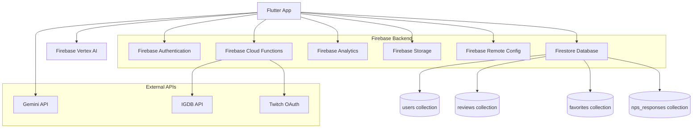

# Architecture

## Architecture Diagram

## Frontend Architecture
The frontend is a Flutter app built using FlutterFlow. Navigation is handled by go_router and state management uses a combination of provider and FlutterFlow's built-in model-widget pattern.

Each screen has a paired widget and model file under `lib/pages/`:

| Page | Purpose |
|---|---|
| home_page | Landing screen after login |
| feed_page | Browse all user reviews |
| search_page | Search for games via IGDB |
| game_info_page | Full details for a specific game |
| game_review_page | Write a review for a game |
| recommended_games | AI-powered game recommendations |
| profile_creation_page | First-time profile setup |
| edit_profile_page | Update existing profile info |
| profile_view | View a user's public profile |
| n_p_ssurvey | In-app NPS survey |

Authentication state is managed through a `VideoGameTrackerFirebaseUser` provider that streams the current Firebase Auth user and drives navigation between authenticated and unauthenticated flows.

Key frontend packages:
- `flutter_rating_bar` for the star rating input on review pages
- `cached_network_image` for loading and caching game cover art
- `google_fonts` for typography
- `timeago` for human-readable timestamps on reviews
- `image_picker` for profile photo uploads
- `flutter_animate` for UI animations
- `video_player` for any embedded video content

## Backend Architecture
The backend runs entirely on Firebase services.

**Firestore** is the primary database. It has four collections: `users`, `reviews`, `favorites`, and `nps_responses`. See the Database Schema page for full field-level details and security rules.

**Firebase Authentication** manages user identity. It supports email/password, Google, Apple, GitHub, anonymous, JWT, and phone sign-in. When a user signs in for the first time, the app automatically creates their document in the `users` collection. See the Backend Services page for the full auth setup.

**Firebase Cloud Functions** act as a proxy layer between the app and the IGDB API. The app never calls IGDB directly so that API credentials stay off the client. Functions are deployed in us-central1 and us-east1. See the API Documentation page for endpoint details.

**Firebase Analytics** tracks events throughout the user journey, from signup through review submission. Session data, DAU, and retention are collected automatically. Custom events are fired for key user actions. See the Metrics page for the full list.

**Gemini API and Firebase Vertex AI** power the AI features. The `GeminiRecommendationCall` uses the `gemini-2.0-flash` model for game recommendations. The `google_generative_ai` SDK supports general text generation with `gemini-1.5-pro` and image-based generation with `gemini-1.5-flash`. Firebase Vertex AI manages multi-turn chat sessions through a `ChatManager` singleton. See the Backend Services page for configuration details.

**Firebase Remote Config** is configured as a dependency and can be used to control feature flags and app behavior without a code release.

**Firebase Performance Monitoring** is configured to track app performance metrics.

**Firebase Storage** handles any media file uploads, such as profile photos.
