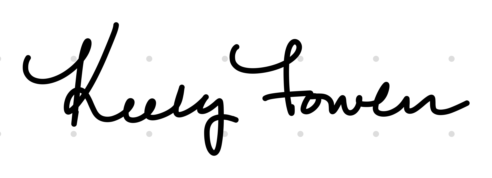
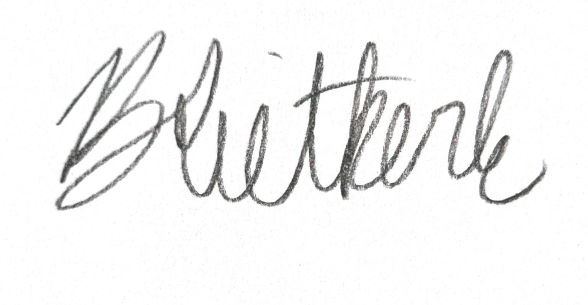

# Contributor Covenant Code of Conduct

## Our Pledge

We as members, contributors, and leaders pledge to make participation in our team a welcoming and harassment-free experience for everyone, regardless of age, body size, visible or invisible disability, ethnicity, sex characteristics, gender identity and expression, level of experience, education, socio-economic status, nationality, personal appearance, race, caste, color, religion, or sexual identity and orientation.

We pledge to act and interact in ways that contribute to an open, welcoming, and healthy team environment where everyone feels comfortable contributing.

---

## Team Agreements

### Technology Policy (305Soft Policy)

In line with the 305Soft no-distracted-technology policy, phones should be put away and silenced during all team meetings. If you need to use your laptop during a meeting, please keep it focused on the project. We want everyone to feel like their time and contributions are respected.

---

### Decisions

We will aim for consensus when making decisions as a team. During our sprint planning and retrospective meetings, everyone should feel comfortable sharing their opinion before anything is finalized. If we cannot reach consensus after a reasonable discussion, we will take a majority vote. For bigger decisions that affect the project direction, we will try to make sure everyone has had a chance to weigh in, whether synchronously or through Discord.

---

### Attendance

Everyone is expected to attend sprint ceremonies including sprint planning, standups, sprint reviews, and retrospectives. These are short and important, and the whole team benefits from being present.

If you need to miss a meeting, please give the team a heads up in Discord as early as you can. Life happens, and legitimate reasons like illness, family emergencies, or conflicting academic obligations are completely understood. If you do miss a meeting, you are responsible for reading the notes shared in Discord, catching up on any decisions made, and completing any tasks assigned to you by the agreed sprint deadline.

Missing members will not be left behind, but repeated unexcused absences will be addressed as a team.

---

### Assignments

Tasks will be assigned during sprint planning based on each member's interests, strengths, and a fair split of the workload. Everything will be tracked on our project board so it is clear who owns what and when it is due.

If something comes up and you cannot finish a task, please let the team know before the deadline, not after. We can help or adjust as needed. If a pattern of incomplete work develops, the team will have a private and respectful conversation first, and escalate only if necessary.

---

### Participation

Discord is our main communication channel. Everyone is expected to check in and respond to messages within 24 hours on weekdays. For quick updates during the sprint, we will use short async standups in Discord if a synchronous meeting is not possible.

We want everyone to contribute in a way that plays to their strengths. At the start of the project and at each sprint retrospective, we will check in on how work is distributed and whether anyone wants to try something new. No one should feel stuck doing the same thing every sprint if they want to grow.

---

### Meeting Times and Locations

We will use a scheduling tool like when2meet at the start of each sprint to find times that work for everyone. Meetings can be held in person or over a video call depending on what the team agrees on. Recurring meeting times will be set early and only changed when necessary with everyone's agreement.

---

### Agenda and Minutes

Before each meeting, one team member will put together a short agenda and share it in Discord. We will rotate who does this so it does not fall on the same person every time. Another team member will take notes during the meeting, including what was discussed, what was decided, and what the action items are. Notes will be shared in Discord within 24 hours of the meeting.

---

### Promptness

Please try to show up on time. If you are running late, just send a message in Discord so the team knows. We will give a five minute buffer before starting. Consistent lateness will be brought up kindly in a retrospective so we can figure out if something needs to change.

---

### Conversational Courtesies

We want meetings to feel like a real conversation, not a presentation. Please listen when others are talking, give everyone a chance to share their thoughts, and keep feedback focused on the work rather than the person. If we get off track during a meeting, we can drop side topics in a Discord thread to revisit later so we stay on schedule.

Disagreements are normal and healthy, especially in a creative and technical project like this. We just ask that everyone stays respectful and assumes good intent.

---

### Enforcement and Feedback

We would rather address things early and informally than let small issues grow. If something is bothering you, please reach out privately to a teammate or bring it up in a retrospective. Retrospectives are a built-in part of our Scrum process and a natural space to talk about what is and is not working.

If a situation does need to be escalated, we will follow these steps:

1. A private, friendly conversation between the people involved.
2. A group discussion during a retrospective if the issue continues.
3. Escalation to the course instructor if the situation is not resolved.

Everyone deserves to feel heard. Feedback should be honest, kind, and focused on helping the team improve.

---

## Our Standards

Examples of behavior that contributes to a positive team environment include:

* Showing up and communicating openly
* Being respectful of different opinions and working styles
* Giving and receiving feedback with good intentions
* Taking responsibility when something does not go as planned
* Thinking about what is best for the team, not just yourself

Examples of unacceptable behavior include:

* Harassment, insults, or personal attacks of any kind
* Dismissing or talking over other team members
* Ignoring team communications without explanation
* Using your phone or unrelated technology during team meetings
* Publishing anyone's private information without permission

---

## Enforcement Responsibilities

All team members share responsibility for keeping our environment respectful. If behavior becomes a repeated problem, any team member may bring it to the group or escalate to the instructor.

---

## Scope

This Code of Conduct applies to all team spaces including Discord, meetings, shared documents, the GitHub repository, and any official project communication.

---

## Enforcement

Instances of unacceptable behavior can be reported to the team lead or course instructor at [INSERT CONTACT METHOD]. All concerns will be handled respectfully and with discretion.

---

## Enforcement Guidelines

### 1. Correction

**Community Impact**: Unprofessional or unwelcome behavior.

**Consequence**: A private conversation to address the issue and explain why the behavior was a problem. A simple acknowledgment from the person involved is expected.

### 2. Warning

**Community Impact**: A repeated or more significant violation.

**Consequence**: A formal warning from the team, with an expectation that the behavior stops. Continued issues may lead to further action.

### 3. Temporary Removal

**Community Impact**: A serious or sustained violation of team norms.

**Consequence**: Temporary removal from team communication and responsibilities for a defined period, discussed with the instructor.

### 4. Permanent Removal

**Community Impact**: A pattern of behavior that cannot be resolved after multiple attempts.

**Consequence**: Permanent removal from the team, handled in coordination with the course instructor.

---

## Attribution

This Code of Conduct is adapted from the [Contributor Covenant][homepage], version 2.1, available at [https://www.contributor-covenant.org/version/2/1/code_of_conduct.html][v2.1].

Community Impact Guidelines were inspired by [Mozilla's code of conduct enforcement ladder][Mozilla CoC].

[homepage]: https://www.contributor-covenant.org
[v2.1]: https://www.contributor-covenant.org/version/2/1/code_of_conduct.html
[Mozilla CoC]: https://github.com/mozilla/diversity
[FAQ]: https://www.contributor-covenant.org/faq
[translations]: https://www.contributor-covenant.org/translations

---
## Contacts

Keely Fowler: keelyfowler@uri.edu

Nate Barrios: nate.barrios@uri.edu

Bianca Riekerk: brietkerk2024@uri.edu

Liam Washburn: liam_washburn@uri.edu 

## Signatures 

