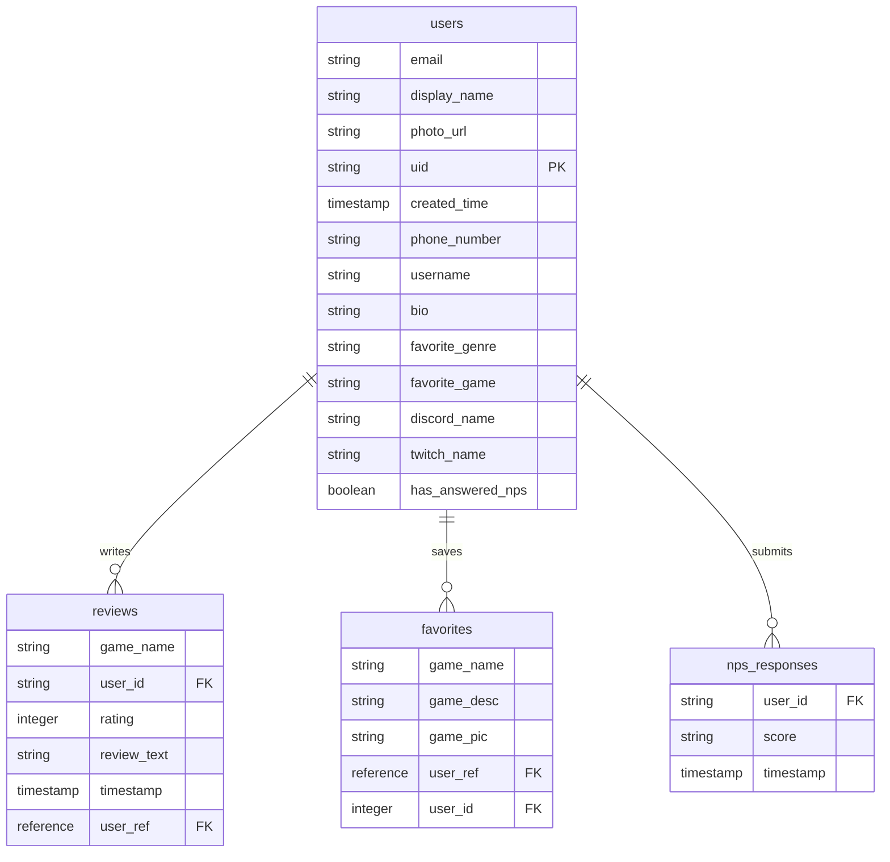

# Database Schema

The app uses Firebase Firestore as its database. Firestore is a NoSQL document store organized into collections and documents. There are four collections: `users`, `reviews`, `favorites`, and `nps_responses`.

## Database Diagram

## Collections and Documents

### users
Each document represents one user account. The document ID matches the Firebase Auth UID. A user document is created automatically on first sign-in via the `maybeCreateUser` function.

| Field | Type | Description |
|---|---|---|
| email | String | The user's email address |
| display_name | String | Display name from the auth provider or set by the user |
| photo_url | String | URL to the user's profile photo |
| uid | String | Firebase Auth UID |
| created_time | Timestamp | When the account was first created |
| phone_number | String | Phone number (optional) |
| username | String | App-specific username chosen during profile creation |
| bio | String | Short bio written by the user |
| favorite_genre | String | The user's favorite game genre |
| favorite_game | String | The user's all-time favorite game |
| discord_name | String | The user's Discord handle |
| twitch_name | String | The user's Twitch username |
| has_answered_nps | Boolean | Whether the user has completed the NPS survey |

### reviews
Each document represents one review written by a user for a specific game.

| Field | Type | Description |
|---|---|---|
| game_name | String | The name of the game being reviewed |
| user_id | String | The UID of the user who wrote the review |
| rating | Integer | Star rating from 1 to 5 |
| review_text | String | The written review content |
| timestamp | Timestamp | When the review was submitted |
| user_ref | DocumentReference | Reference to the reviewer's document in the users collection |

### favorites
Each document represents one game that a user has saved to their favorites list.

| Field | Type | Description |
|---|---|---|
| game_name | String | The name of the favorited game |
| game_desc | String | Short description of the game |
| game_pic | String | URL to the game's cover art |
| user_ref | DocumentReference | Reference to the user's document in the users collection |
| user_id | Integer | The user's ID (note: typed as int in this collection) |

### nps_responses
Each document stores one NPS survey response from a user.

| Field | Type | Description |
|---|---|---|
| user_id | String | The UID of the user who responded |
| score | String | The NPS score the user submitted |
| timestamp | Timestamp | When the response was recorded |

## Fields and Data Types Summary

Firestore field types in use:
- `String` for text fields (names, URLs, IDs stored as strings)
- `Integer` for numeric values like star ratings
- `Boolean` for flags like `has_answered_nps`
- `Timestamp` for date/time fields
- `DocumentReference` for cross-collection references between reviews/favorites and users

## JSON Schemas

The 305Soft standard JSON schemas for each collection are in the `docs/schemas/` folder.

- [users_schema.json](schemas/users_schema.json)
- [reviews_schema.json](schemas/reviews_schema.json)
- [favorites_schema.json](schemas/favorites_schema.json)
- [nps_responses_schema.json](schemas/nps_responses_schema.json)
