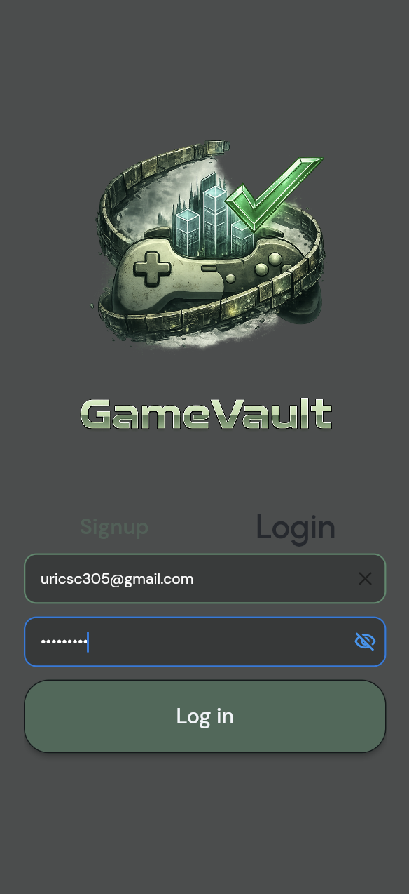
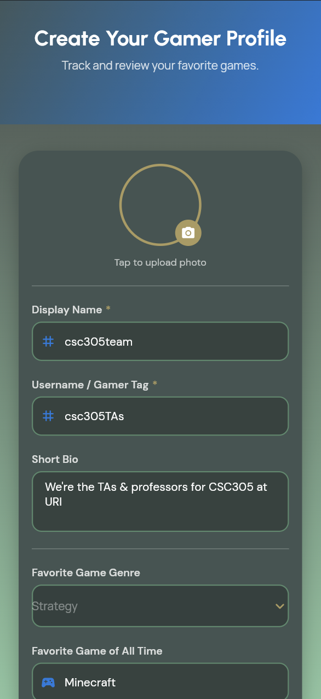
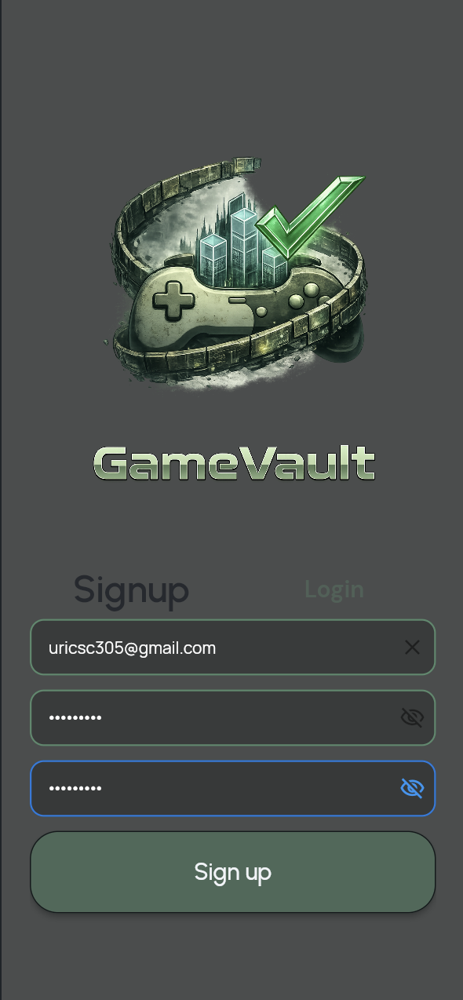
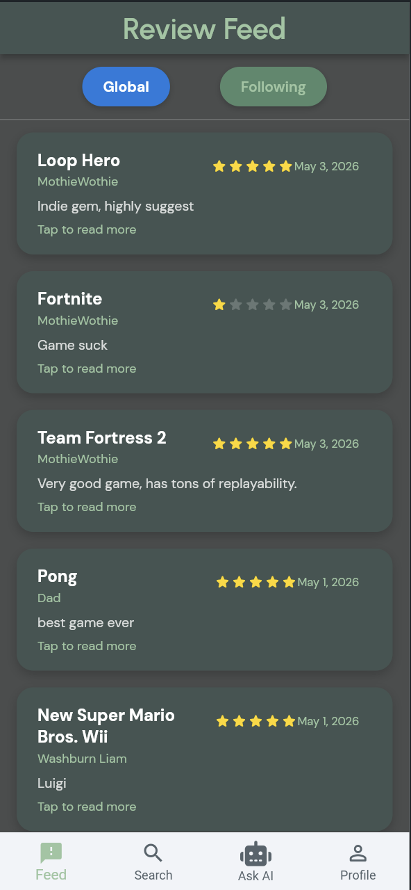
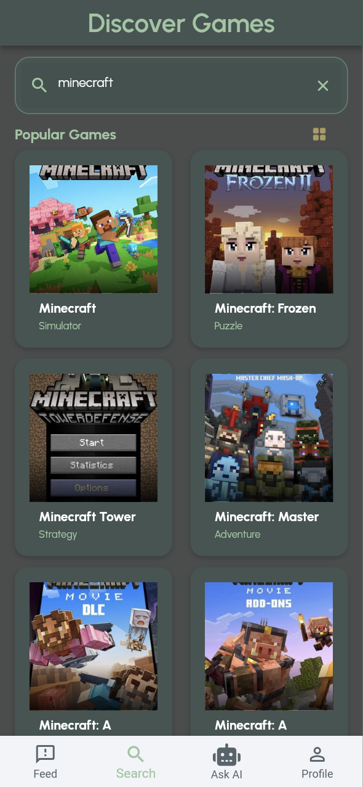
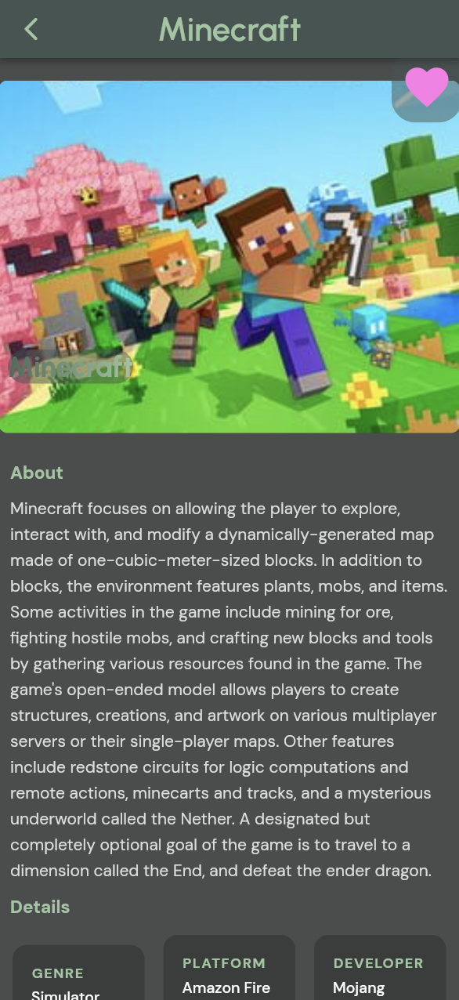
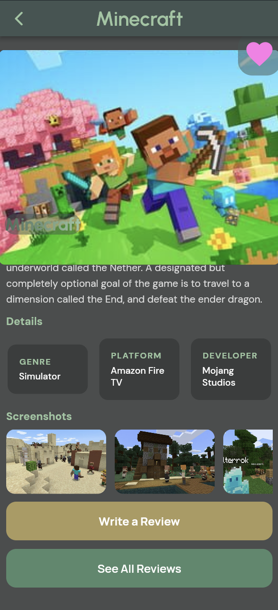
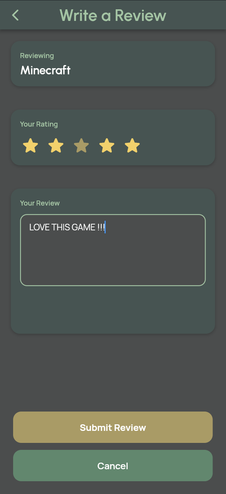
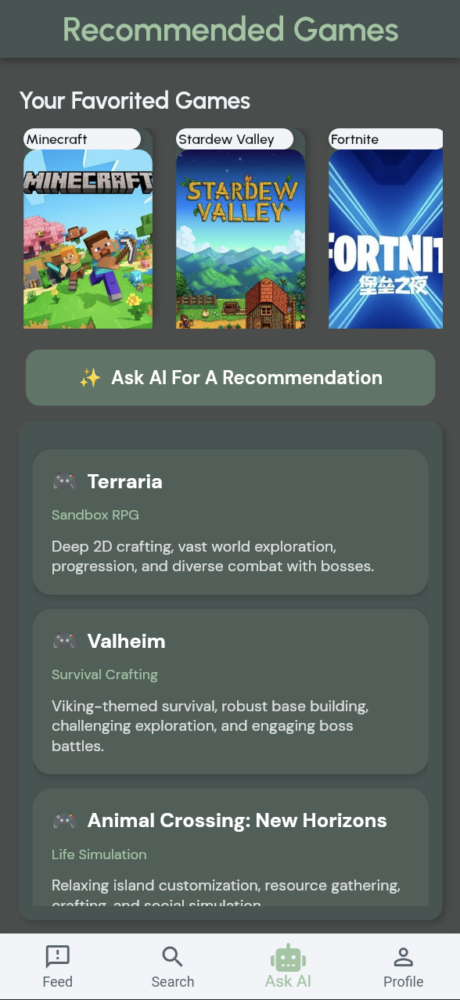
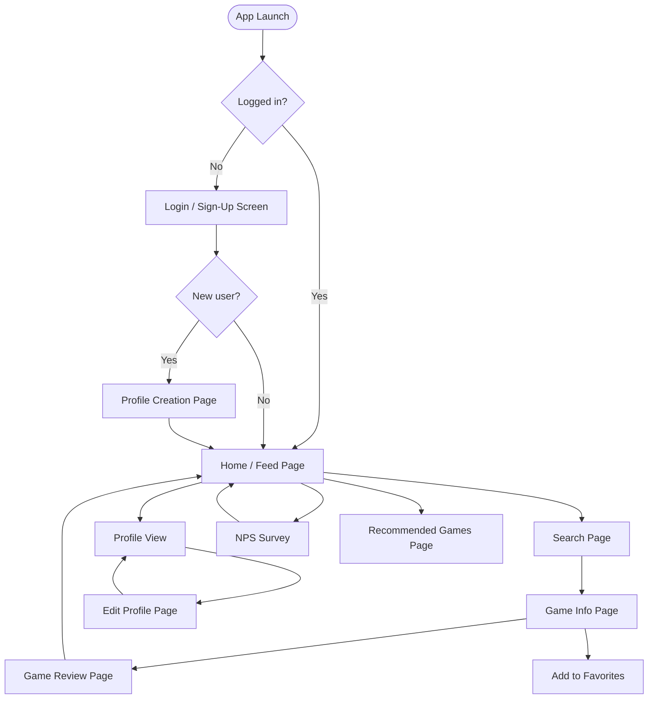

# UX Flow

## Wireframes

| Login | Login (cont.) | Login (cont.) |
|---|---|---|
|  |  |  |

| Feed | Search | Game Info |
|---|---|---|
|  |  |  |

| Game Info (cont.) | Write Review | AI Recommendations |
|---|---|---|
|  |  |  |

## App Screen Flow

The golden path runs: **Sign Up / Login > Profile Creation > Feed / Search > Game Info > Write Review**

### Screen by Screen

**Login / Sign-Up Screen (ss_login1, ss_login2, ss_login3)**
New and returning users land here first. The screen supports email/password sign-in, Google sign-in, and new account creation. After a successful auth event, the app checks whether the user already has a Firestore document. First-time users get routed to Profile Creation. Returning users go directly to the Home/Feed.

**Profile Creation Page**
First-time users fill out their profile: username, bio, favorite genre, favorite game, Discord handle, and Twitch name. This step can be skipped, though we are A/B testing a variant where it is prompted but still dismissible. See the A/B Testing page for details on that experiment.

**Home Page**
The main landing screen after login for returning users.

**Feed Page (ss_feed.png)**
Shows reviews posted by all users. Users can scroll through the feed and read what other people have said about various games. Tapping a review card leads to the full review or game info.

**Search Page (ss_search.png)**
Users type a game title and the app calls the IGDB API through Cloud Functions. Results come back with cover art, game name, and basic metadata. Tapping a result goes to the Game Info page.

**Game Info Page (ss_game1.png, ss_game2.png)**
Full details for a selected game: cover art, summary, IGDB rating, release date, genres, platforms, developer, and screenshots. From here users can write a review or save the game to their favorites.

**Game Review Page (ss_review.png)**
Users pick a star rating (1 to 5) and write a text review. Submitting saves the review to the `reviews` Firestore collection and returns the user to the feed.

**Recommended Games Page (ss_ai.png)**
Pulls the user's current favorites list and sends it to the Gemini API. The response is a single game recommendation with its name, genre, and a short description.

**Profile View Page**
Shows a user's public profile including their username, bio, favorite genre, favorite game, Discord handle, and Twitch name.

**Edit Profile Page**
Users can update any of their profile fields. Changes are saved back to their document in the `users` Firestore collection.

**NPS Survey**
Shown to users who have not yet completed the NPS survey (checked via the `has_answered_nps` field on the user document). Users answer a satisfaction question and the response is stored in the `nps_responses` collection. The flag is set to true after submission so it only appears once.
